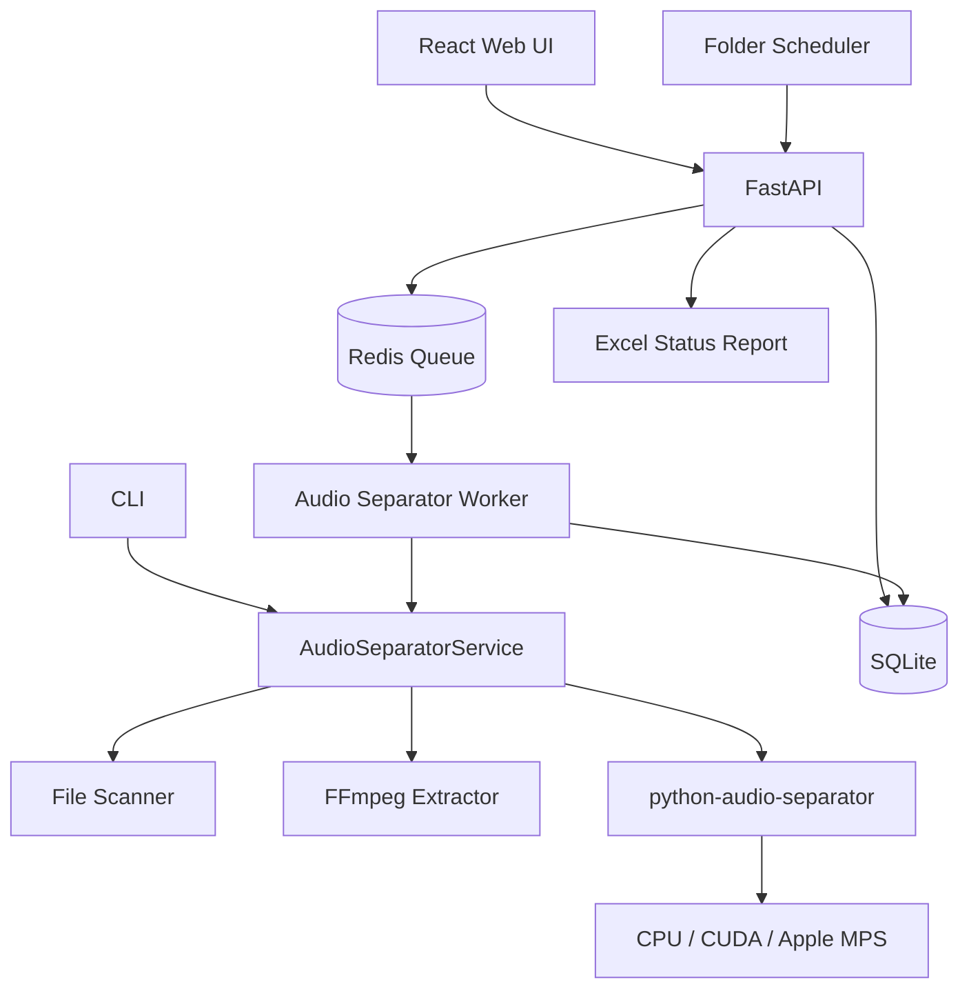

# StemFlow · Audio Separator Service

StemFlow 把开源项目 [python-audio-separator](https://github.com/nomadkaraoke/python-audio-separator) 封装成一个本地部署的 AI 人声分离服务。用户可以通过 Web 选择文件夹，也可以通过 CLI 批量处理视频和音频；两种入口共用同一个 `AudioSeparatorService`，没有复制或修改上游模型推理代码。

## 能力

- 扫描目录中的 `mp4`、`mov`、`mkv`、`avi`、`mp3`、`wav`、`flac`、`m4a`、`ogg`
- 视频通过 FFmpeg 自动提取 44.1 kHz 双声道 WAV 音轨
- 通过上游公开 Python API `Separator.load_model()` / `Separator.separate()` 完成人声分离
- 输出固定整理为 `<output>/<文件名>/vocals.wav` 与 `instrumental.wav`
- Web 支持本地路径和浏览器整文件夹上传、实时进度、试听与下载
- CLI 支持单文件与目录批处理，并提供面向 AI/Agent 的稳定 JSON 协议、任务等待和结果下载
- SQLite 保存任务、文件状态、日志和结果索引；Redis 连接 API 与独立 worker
- 支持任务级和同一批次文件级并发；每个推理槽位拥有独立模型实例
- 支持固定文件夹定时扫描、文件稳定检测、去重、失败重试和 Excel 状态表
- Windows、macOS 与 Linux 均可通过 Docker Compose 运行；Windows 另提供 PowerShell 一键脚本
- Docker Compose 默认 CPU 运行，可切换 NVIDIA CUDA worker

## 一键启动（CPU）

需要 Docker Desktop / Docker Engine 和 Docker Compose。

```bash
cd audio-separator-service
docker compose up --build
```

打开：

- Web 管理界面：<http://localhost:3000>
- API 文档：<http://localhost:8000/docs>

把待处理文件放入 `data/input/`，Web 中使用默认输入 `/input` 和输出 `/output`；也可以在 Web 中点击“上传文件夹”，直接上传本机目录。

> 第一次选择某个模型时会从上游模型源下载权重，并缓存到 `data/models/`。下载时间取决于模型体积和网络速度。

## Windows 一键启动

推荐 Windows 10/11 使用 Docker Desktop 的 WSL 2 Linux 容器后端。双击 `start-windows.cmd` 会以 CPU 模式启动，并把项目的 `data/input` 与 `data/output` 映射为 Web 中的 `/input` 和 `/output`。

也可以在 PowerShell 中指定任意 Windows 文件夹：

```powershell
.\start-windows.cmd `
  -InputPath "D:\Videos" `
  -OutputPath "D:\StemFlow-Results"
```

使用 NVIDIA GPU：

```powershell
.\start-windows.cmd -Mode gpu `
  -InputPath "D:\Videos" `
  -OutputPath "D:\StemFlow-Results"
```

脚本会检查 Docker、等待 API 健康，并在 GPU 模式下输出容器内的 CUDA 检测结果。停止服务时双击 `stop-windows.cmd`；模型、结果和任务记录不会被删除。完整说明及故障排查见 [Windows 部署指南](docs/windows.md)。

## NVIDIA GPU 启动

主机需要 NVIDIA 驱动、Docker 和 NVIDIA Container Toolkit。

```bash
docker compose -f docker-compose.yml -f docker-compose.gpu.yml up --build
```

GPU 配置只替换推理 worker，Web、API、任务数据库和 Redis 保持不变。可用以下命令检查容器是否识别到 CUDA：

```bash
docker compose exec worker python3 -c "import onnxruntime as ort; print(ort.get_available_providers())"
```

输出包含 `CUDAExecutionProvider` 才表示 ONNX 模型会使用 NVIDIA GPU。Demucs / Roformer 是否使用 CUDA还取决于容器内 PyTorch 的 CUDA 可用性。

## 并发处理

CPU 部署默认启动2个独立推理槽位，同一批次中的不同音频、不同任务中的音频都可以被并行领取：

```bash
AUDIO_SERVICE_WORKER_CONCURRENCY=4 docker compose up -d --build
```

每个槽位都会独立加载并缓存一份模型，所以并发数也会近似成倍增加内存占用。建议：

| 环境 | 建议并发 |
| --- | ---: |
| 8 GB Docker 内存、CPU MDX | 1–2 |
| 16 GB Docker内存、CPU MDX | 2–4 |
| 单张8 GB NVIDIA GPU、Roformer | 1 |
| 16–24 GB NVIDIA GPU | 1–2，需观察显存 |

GPU Compose 默认保持1并发。确认显存充足后可显式提高：

```bash
AUDIO_SERVICE_GPU_WORKER_CONCURRENCY=2 \
docker compose -f docker-compose.yml -f docker-compose.gpu.yml up -d --build
```

`GET /api/health` 和 `stemflow health --json` 会返回当前配置的 `worker_concurrency`。任务列表中的多个 item 可以同时显示为 `extracting_audio` 或 `separating`。Redis 负责文件级作业分发，SQLite 使用 WAL 和忙等待保护并发状态写入，输出目录通过原子预留避免同名文件互相覆盖。

## 固定文件夹自动处理

打开 Web 的“自动处理”面板，设置监控目录、输出目录和执行时间，保存并启用即可进入无人值守模式。计划由 FastAPI 后台服务执行，Web 页面关闭后不会停止。Docker 默认路径：

```text
监控目录：/input
输出目录：/output
Excel：  /data/processing_status.xlsx
```

默认按北京时间每天 `00:00` 扫描一次；也可以切换为按分钟间隔执行。文件最后修改时间超过60秒才会入队，避免处理尚未复制完成的文件。系统使用“绝对路径＋文件大小＋修改时间”生成文件版本指纹：

- 相同版本只处理一次；
- 同一路径文件发生变化后会作为新版本处理；
- 默认失败最多自动重试3次；
- 子目录结构会保留到输出目录；
- 原始文件不会被修改或删除。

自动发现的每个文件都会复用现有 Redis 任务队列，因此仍受 `AUDIO_SERVICE_WORKER_CONCURRENCY` 控制。数据库是可靠状态源，Excel 是便于人工审阅的同步报表，包含等待、处理中、完成、失败、重试次数、结果路径、耗时和错误信息。

也可以通过环境变量提供首次启动默认值：

```bash
AUDIO_SERVICE_AUTOMATION_ENABLED=true \
AUDIO_SERVICE_AUTOMATION_SCHEDULE_MODE=daily \
AUDIO_SERVICE_AUTOMATION_DAILY_TIME=00:00 \
AUDIO_SERVICE_AUTOMATION_TIMEZONE=Asia/Shanghai \
AUDIO_SERVICE_AUTOMATION_STABLE_SECONDS=60 \
AUDIO_SERVICE_AUTOMATION_MAX_RETRIES=3 \
docker compose up -d --build
```

为避免升级后意外处理已有 `/input` 内容，默认 `AUDIO_SERVICE_AUTOMATION_ENABLED=false`；在 Web 保存启用后，配置会持久化到 SQLite。启用每日计划不会立即运行，首次执行安排在下一个设定时间；需要立刻补跑时使用“立即扫描”。

## CLI

CLI 1.0 新增 `stemflow` 命令。AI/Agent 推荐通过 stdin 发送一个 JSON 请求，stdout 只会返回一个 JSON 信封：

```bash
printf '%s' '{"action":"health"}' | stemflow agent
```

服务使用 Docker 运行时，可以直接通过项目根目录包装命令调用：

```bash
./stemflow capabilities --json       # macOS / Linux
.\stemflow.cmd capabilities --json  # Windows
```

支持 `capabilities`、本机 `separate`、`task create/get/wait/files/logs/download` 等完整能力。JSON Schema、退出码、路径规则、Python/TypeScript 调用示例和 Agent 重试策略见 [StemFlow CLI 与 AI Agent 接入指南](docs/cli-for-ai.md)。原来的 `audio-separator-service --input ...` 命令保持兼容。

### Docker 内运行

```bash
docker compose run --rm backend audio-separator-service \
  --input /input \
  --output /output \
  --model default
```

### 本机安装

要求 Python 3.10+ 和 FFmpeg：

```bash
cd backend
python -m venv .venv
source .venv/bin/activate
pip install -e ".[cpu]"
audio-separator-service --input ./videos --output ./results
```

单文件和文件夹使用同一命令：

```bash
audio-separator-service --input ./video.mp4 --output ./result
audio-separator-service --input ./videos --output ./results --model mdx
audio-separator-service --input ./long.wav --output ./results --chunk-duration 600
```

使用 `--json` 可输出机器可读的结果列表。

### Windows 原生 CLI

双击 `setup-cli-windows.cmd`。脚本会创建隔离环境、安装 CPU 推理依赖，并提供自带的 Windows FFmpeg，不要求用户另外配置 FFmpeg：

```powershell
.\.venv-windows\Scripts\audio-separator-service.exe `
  --input "C:\Users\me\Videos" `
  --output "D:\StemFlow-Results" `
  --model mdx
```

Windows 原生 CLI 不需要 Redis。需要 NVIDIA GPU 时推荐使用上面的 Docker GPU 模式，避免 Windows 本机 CUDA、PyTorch 与 ONNX Runtime 版本组合不一致。

## 模型配置

| 参数 | 上游模型 | 适用场景 |
| --- | --- | --- |
| `default` / `roformer` | `model_bs_roformer_ep_317_sdr_12.9755.ckpt` | 默认，人声分离质量优先 |
| `mdx` / `uvr` | `UVR-MDX-NET-Inst_HQ_3.onnx` | ONNX，速度与质量均衡 |
| `demucs` | `htdemucs_ft.yaml` | Demucs v4，多音轨后合成为伴奏 |

默认 Docker CPU 配置使用 MDX，以避免在约 8 GB Docker 内存下加载 Roformer 时被系统终止；它适合兼容运行，但复杂影视对白中可能残留配乐。NVIDIA GPU 覆盖配置会把 `default` 切换为高质量 Roformer。Apple Silicon 可在 macOS 原生 Python 环境中使用 MPS 运行 Roformer，质量通常明显优于 Docker CPU 的 MDX。可通过 `AUDIO_SERVICE_DEFAULT_MODEL`、`AUDIO_SERVICE_MDX_SEGMENT_SIZE`、`AUDIO_SERVICE_MDXC_SEGMENT_SIZE` 和 `AUDIO_SERVICE_MDXC_OVERRIDE_MODEL_SEGMENT_SIZE` 调整。

也可以把上游 `--list_models` 中的模型文件名直接作为 `model` 传入。上游会在第一次加载时自动下载模型。两音轨模型直接生成 `vocals.wav` 和 `instrumental.wav`；多音轨模型的非人声 stems 会由 FFmpeg 混合为 `instrumental.wav`，推理本身不做修改。

## API

### 创建任务

```http
POST /api/tasks
Content-Type: application/json

{
  "input_dir": "/input",
  "output_dir": "/output",
  "model": "default"
}
```

返回 HTTP `202`：

```json
{
  "id": "f7c7...",
  "status": "waiting",
  "progress": 0,
  "current_file": null,
  "input_dir": "/input",
  "output_dir": "/output",
  "model": "default",
  "total_files": 0,
  "completed_files": 0,
  "failed_files": 0,
  "created_at": "2026-07-22T10:00:00Z",
  "started_at": null,
  "finished_at": null,
  "error": null
}
```

### 查询

- `GET /api/tasks`：任务列表
- `GET /api/tasks/{id}`：任务进度与当前文件
- `GET /api/tasks/{id}/items`：每个输入文件的状态与耗时
- `GET /api/tasks/{id}/files`：原文件、人声、伴奏的播放和下载地址
- `GET /api/tasks/{id}/logs`：任务日志
- `POST /api/uploads`：浏览器文件夹上传
- `GET /api/health`：服务状态
- `GET /api/automation`：自动处理配置和汇总状态
- `PUT /api/automation`：保存并启用/关闭自动处理
- `POST /api/automation/scan`：立即扫描
- `POST /api/automation/retry-failed`：重新提交失败文件
- `GET /api/automation/files`：自动处理文件记录
- `GET /api/automation/report`：下载 `processing_status.xlsx`

## 输出结构

```text
data/output/
├── video1/
│   ├── vocals.wav
│   └── instrumental.wav
├── video2/
│   ├── vocals.wav
│   └── instrumental.wav
└── album/
    └── audio1/
        ├── vocals.wav
        └── instrumental.wav
```

输入目录存在子目录时，输出会保留相对目录。若同一目录中出现同名但扩展名不同的媒体，会自动追加扩展名避免覆盖。

## 架构



核心目录：

```text
audio-separator-service/
├── backend/
│   ├── app/api/             # FastAPI 路由
│   ├── app/cli/             # CLI 入口
│   ├── app/services/        # scanner / extractor / separator / automation / task processor
│   ├── app/worker/          # Redis worker
│   └── tests/
├── frontend/                # React + TypeScript + TailwindCSS
├── scripts/windows/         # Windows Docker 与 CLI PowerShell 脚本
├── data/                    # 输入、输出、上传、模型和任务数据库
├── docker-compose.yml       # CPU
└── docker-compose.gpu.yml   # NVIDIA CUDA 覆盖配置
```

## 本地开发

后端：

```bash
cd backend
pip install -e ".[cpu,dev]"
AUDIO_SERVICE_DATA_DIR=../data AUDIO_SERVICE_TASK_MODE=local \
  uvicorn app.main:app --reload --port 8000
```

前端：

```bash
cd frontend
npm install
npm run dev
```

开发模式的 Vite 会把 `/api` 转发到 `localhost:8000`。`TASK_MODE=local` 时 FastAPI 会在本进程后台运行任务，适合调试；Compose 使用 Redis 和独立 worker。

运行测试：

```bash
cd backend && pytest
cd frontend && npm run build
```

## 上游集成说明

本项目开发时核对的上游提交为 `4fe3540c249ff130bd5395c0e9377b3d16970c1a`。分析确认：

1. 公开 API 为 `from audio_separator.separator import Separator`。
2. `Separator(output_dir=..., model_file_dir=..., output_format="WAV")` 负责设备检测和输出配置。
3. `load_model(model_filename=...)` 负责模型查找、首次下载与架构实例化。
4. `separate(audio_path, custom_output_names=...)` 返回生成的 stem 路径。
5. 上游当前覆盖 MDX、VR、Demucs 与 MDXC / Roformer，并提供 CPU、CUDA、CoreML 等执行路径。

StemFlow 只在外层负责扫描、FFmpeg、任务、状态、固定结果命名和 UI，不修改上游 architecture、模型加载或前向推理代码。

## 运行边界

- Docker 容器只能访问挂载到容器中的路径。默认输入与输出为 `/input`、`/output`；任务数据库、模型缓存和上传文件仍位于 `/data`。
- Windows 启动脚本会把 `C:\...` 或 `D:\...` 转换为 Docker Desktop 可挂载的路径。Web 表单始终填写容器路径 `/input`、`/output`，不能直接填写 Windows 盘符。
- 浏览器不能直接把任意本机绝对路径暴露给网页；“上传文件夹”会把文件复制到服务的 `data/uploads/` 后再处理。
- 首次真实推理需要下载较大的模型文件。单元测试使用轻量替身验证流程，不会下载模型或消耗 GPU。
- 生产部署到非可信网络前，应在反向代理层增加登录、TLS、上传大小限制和允许目录白名单。本项目默认面向本机或可信局域网。

## License

本封装代码采用 MIT License。`python-audio-separator` 及模型文件遵循各自的上游许可与使用条款。
